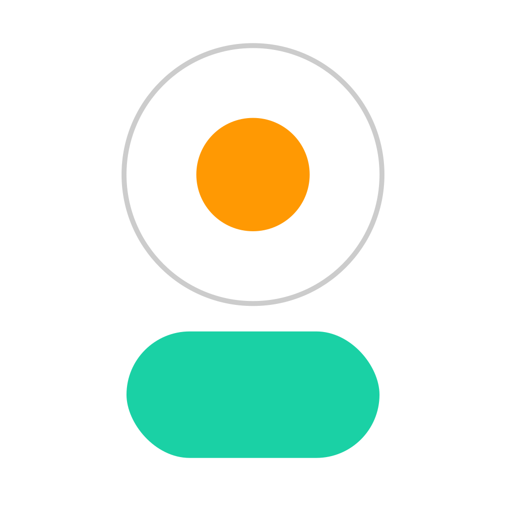

  <h3 align="center">السلام عليكم ورحمة الله وبركاته</h3>
  
I'm **Hasibur Rahman Fahim**, a frontend developer with a passion for creating delightful user interfaces. Welcome to my GitHub profile!

 
<h1 align="center">   SKILLS </h1>
 
 

  
    
    
    
    

         
 
          

  
  
  
  
  
  
  
  
    
  
  
  
  
  
  
  
  
  
  
  
  
  

         
    
  

  
    
    

 
  
 
  <h3 align="center" > CONTACTS </h3>
   <h6 align="center" > Cell: +8801758781699 </h6> 
   <h6 align="center" > Email: hrfahimm@gmail.com </h6> 
   
  
 
  
  
  
    
  
  

  <h3 align="center">LIFE RUNS ON CODE </h3>
  

    
    <!--       -->
  

<!-- 

 -->

